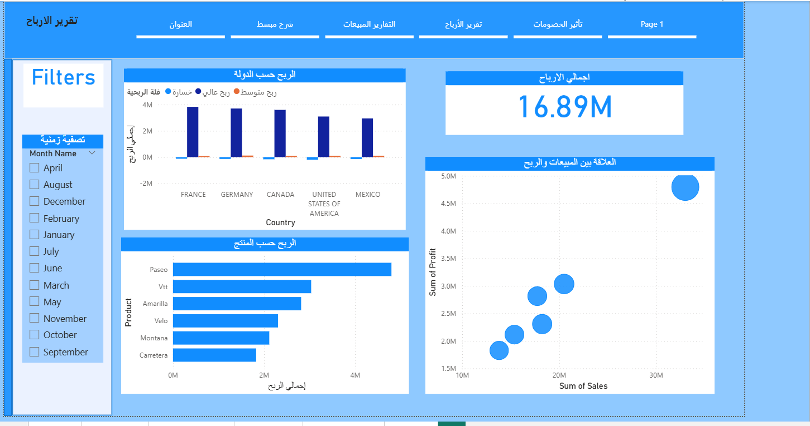
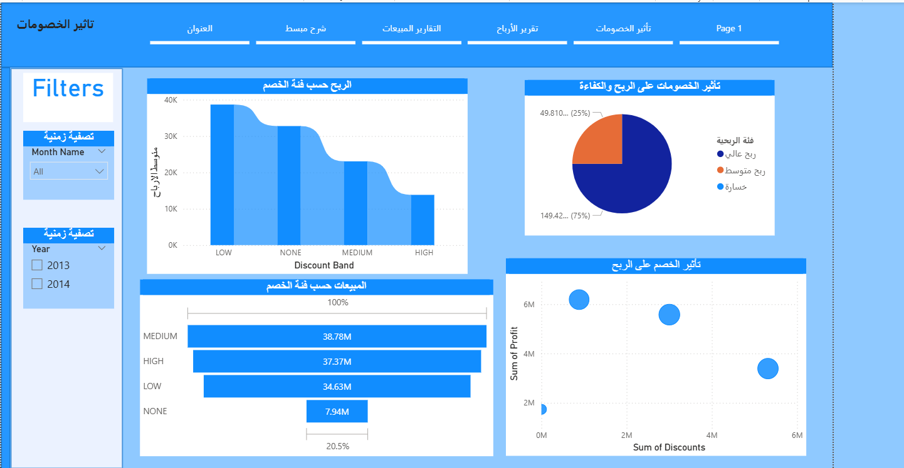

# 📊 Sales & Profit Analysis by Market and Country
<h2>📊 Dashboard Preview</h2>







## 📌 Project Overview
This Power BI project analyzes sales and profit performance across different markets and countries. The dashboard provides interactive insights into revenue trends, profitability, and overall business performance.

## 🎯 Project Objectives
- Analyze total sales and total profit
- Compare performance by country
- Evaluate yearly and monthly sales trends
- Identify the most profitable segments and products

## 📂 Dataset Information
The dataset includes more than 700 records and contains the following fields:

- Country
- Segment
- Product
- Units Sold
- Gross Sales
- Sales
- COGS
- Profit
- Year
- Month Name

## 📊 Key Metrics (DAX Measures)

```DAX
Total Sales = SUM(Financials[ Sales])
Total Profit = SUM(Financials[Profit])


